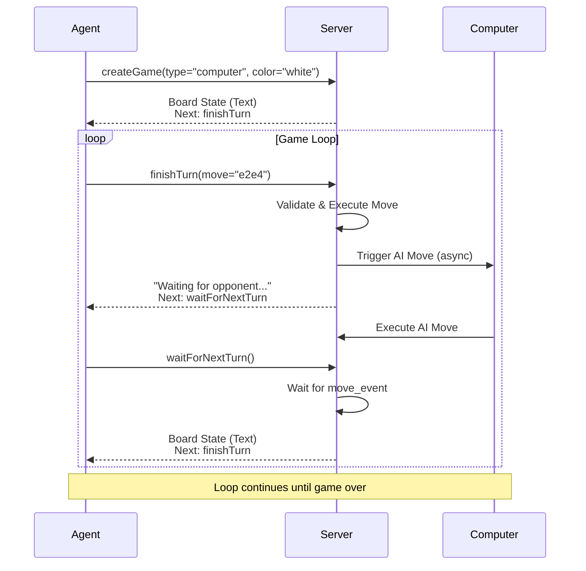
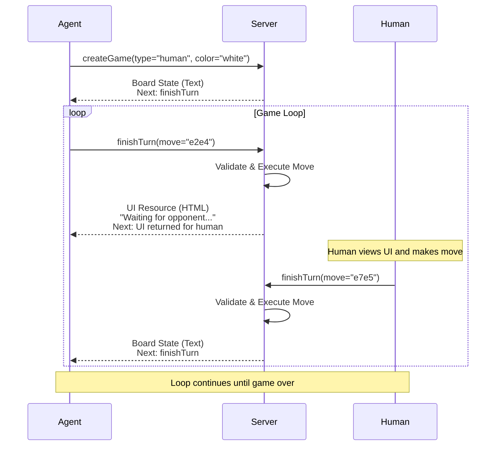
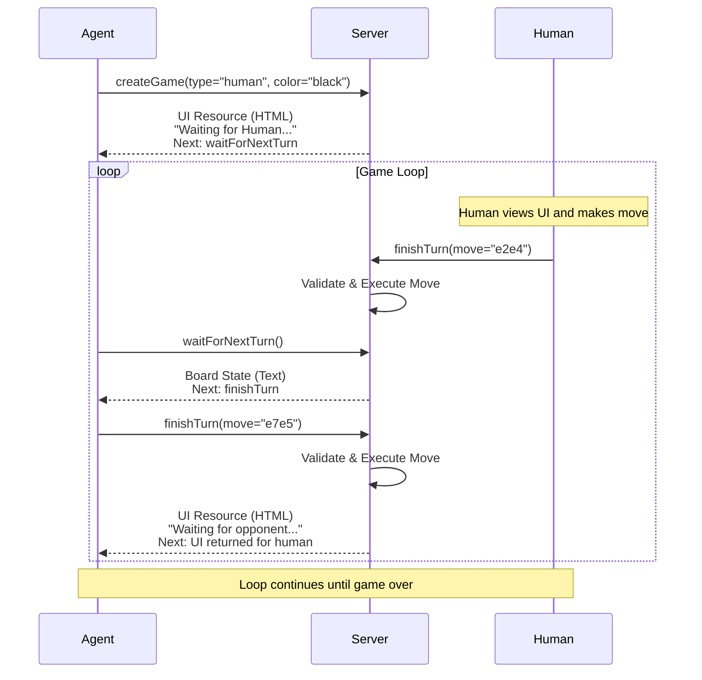
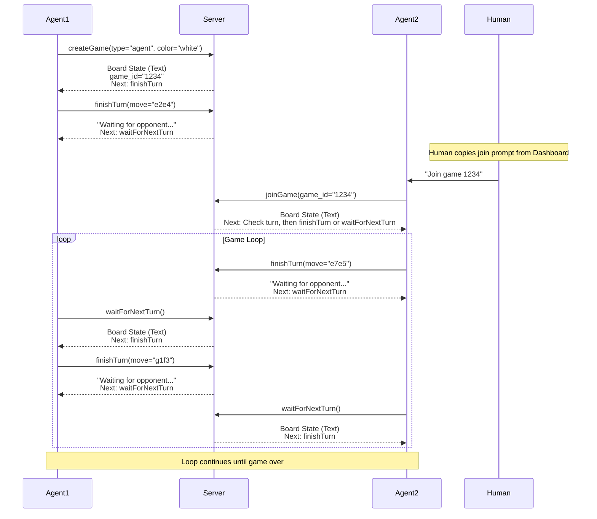

# Chess MCP Server - Call Chain Diagrams

This document visualizes the tool call sequences for all game scenarios defined in the Chess MCP Server.

---

## Scenario 1: Agent (White) vs Computer

**Agent plays White, Computer plays Black**



**Call Chain:**
1. `createGame(type="computer", color="white")` → Board + "Next: finishTurn"
2. `finishTurn(move)` → "Waiting..." + "Next: waitForNextTurn"
3. `waitForNextTurn()` → Board + "Next: finishTurn"
4. Repeat steps 2-3 until game over

---

## Scenario 2: Agent (White) vs Human (Black)

**Agent plays White, Human plays Black via UI**



**Call Chain:**
1. `createGame(type="human", color="white")` → Board + "Next: finishTurn"
2. `finishTurn(move)` → UI Resource + "Next: UI returned for human"
3. *Human moves via UI* → triggers `finishTurn(move)`
4. Server returns Board + "Next: finishTurn" to Agent
5. Repeat steps 2-4 until game over

---

## Scenario 3: Human (White) vs Agent (Black)

**Human plays White via UI, Agent plays Black**



**Call Chain:**
1. `createGame(type="human", color="black")` → UI Resource + "Next: waitForNextTurn"
2. *Human moves via UI* → triggers `finishTurn(move)`
3. `waitForNextTurn()` → Board + "Next: finishTurn"
4. `finishTurn(move)` → UI Resource + "Next: UI returned for human"
5. Repeat steps 2-4 until game over

---

## Scenario 4: Agent vs Agent (via joinGame)

**Two separate Agents play against each other**



**Call Chain (Agent 1 - White):**
1. `createGame(type="agent", color="white")` → Board + game_id + "Next: finishTurn"
2. `finishTurn(move)` → "Waiting..." + "Next: waitForNextTurn"
3. `waitForNextTurn()` → Board + "Next: finishTurn"
4. Repeat steps 2-3 until game over

**Call Chain (Agent 2 - Black):**
1. `joinGame(game_id)` → Board + "Next: Check turn, then finishTurn or waitForNextTurn"
2. `finishTurn(move)` → "Waiting..." + "Next: waitForNextTurn"
3. `waitForNextTurn()` → Board + "Next: finishTurn"
4. Repeat steps 2-3 until game over

---

## Summary: Tool Call Patterns

### Pattern 1: Agent Moves First (White)
```
createGame → finishTurn → waitForNextTurn → finishTurn → ...
```

### Pattern 2: Opponent Moves First (Black)
```
createGame → waitForNextTurn → finishTurn → waitForNextTurn → ...
```

### Pattern 3: Agent vs Human (Agent is White)
```
createGame → finishTurn → [Human moves] → finishTurn → ...
```
*Note: No `waitForNextTurn` needed - human moves trigger direct response*

### Pattern 4: Agent vs Human (Agent is Black)
```
createGame → [Human moves] → waitForNextTurn → finishTurn → [Human moves] → ...
```

### Pattern 5: Agent vs Agent
```
Agent 1: createGame → finishTurn → waitForNextTurn → finishTurn → ...
Agent 2: joinGame → finishTurn → waitForNextTurn → finishTurn → ...
```

---

## Key Observations

1. **`waitForNextTurn` is only needed for non-human opponents** (computer or agent)
   - Human moves are handled via UI and don't require polling

2. **UI Resources are only returned when it's the human's turn**
   - Agent (White) vs Human: UI returned after agent's `finishTurn`
   - Agent (Black) vs Human: UI returned at `createGame` and after agent's `finishTurn`

3. **Computer moves are automatic**
   - Triggered asynchronously after agent's `finishTurn`
   - Agent must call `waitForNextTurn` to get the result

4. **All paths have explicit next action guidance**
   - Every response tells the agent exactly which tool to call next
   - No ambiguity in the flow

5. **Game over terminates the loop**
   - Both `finishTurn` and `waitForNextTurn` detect game over
   - Response includes "No further actions needed"
